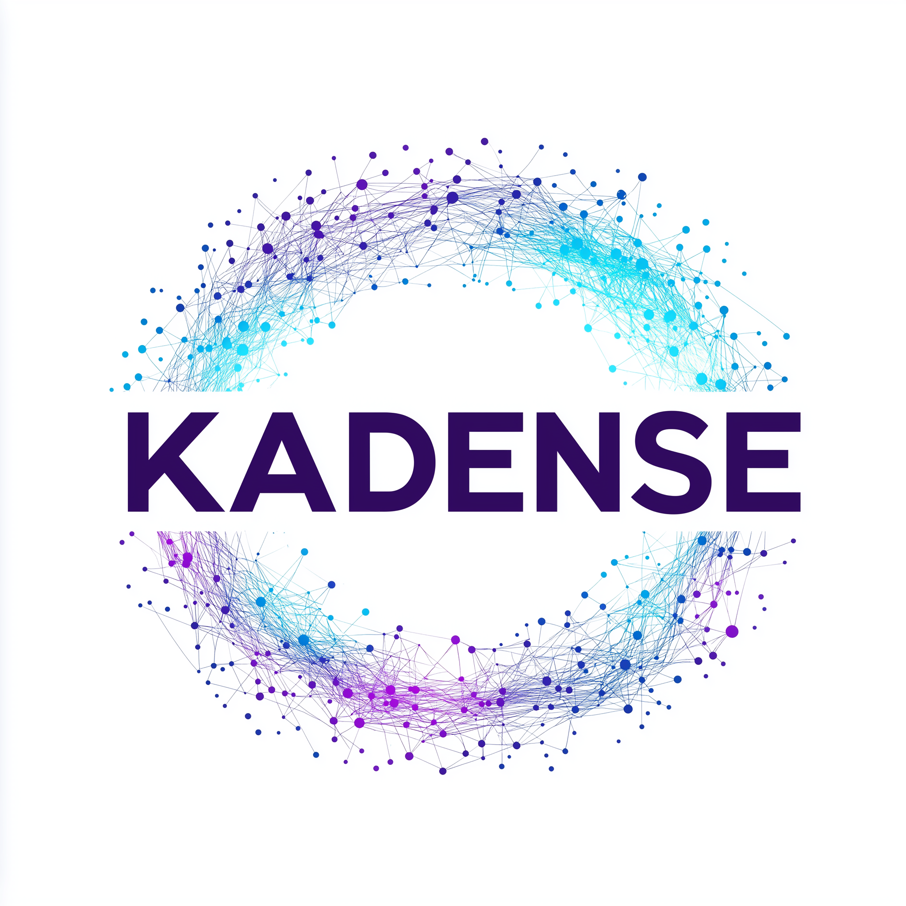

# KADENSE

## What is the KADENSE?
**K**ubernetes **A**dvanced **D**ata **E**cosystem, **N**ourishing **S**ecure **E**nvironments.

KADENSE is an ecosystem for all your data needs in a secure environment, whether you're a healthcare organisation dealing with Secure Patient Data or a bank dealing processing account transactions then KADENSE can help you build a secure, scalable and cost effective solution that can run on any infrastructure using a open source base.

The core components of KADENSE is offered open-source under the Apache 2.0 License. It is therefore free to use, distribute and make changes as you see fit.

KADENSE Enterprise extends the abilities of the core components and makes the solution easier to manage in enterprise environments. We also further extend this by offering consultancy services and managed service offerings of the solution for our customers.

## Data Orchestration using KADENSE
Getting data to where it needs to be, in a cost effective manner is a challenge for any organisation, especially so when you're dealing with particularly sensitive data such as patient medical records. Indeed it's not just a case of getting the data to where it needs to be for the right audience, but on time as well. 

Sometimes the data you need is critical and needs to be updated in real-time, other data doesn't need to be 100% up to date, but needs to be updated in near-real-time so that it eventually consistent, and some data just needs to be updated periodically as part of batch processing. KADENSE provides solutions to all of these challenges using its data contracts engine.

## Trusted Research Environments using KADENSE
KADENSE is capable of providing a gateway for trusted research environments using a hybrid containerised solutions and VDI estate.
