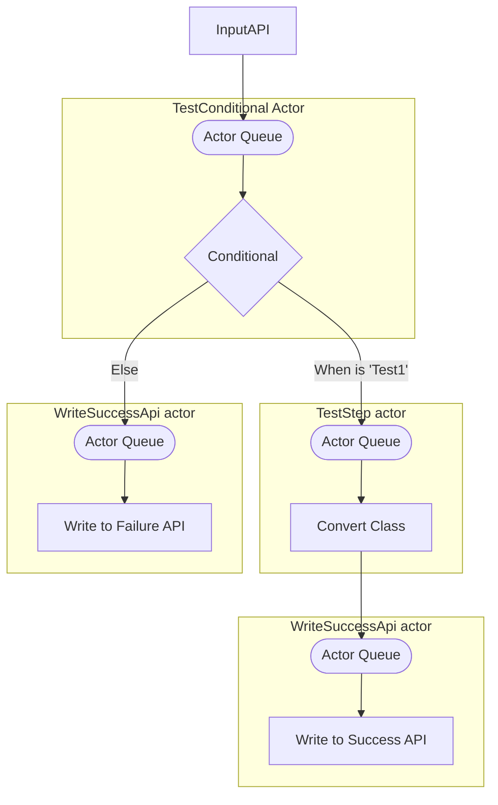

We're fast adding features to the Kadense framework. Our latest addition is a data focused workflow engine that allows you ingest, transform and export data. The workflow engine leverages the capabilities of Malleable API's to provide dynamic API's that can write into the workflow engine.

<!-- truncate -->

You can define a new workflow using the custom resources:

```yaml
apiVersion: kadense.io/v1
kind: MalleableWorkflow
metadata:
    namespace: test-namespace
    name: test-workflow
spec:
    description: |
        Test workflow description
    apis:
      InputApi:
        apiType: Ingress
        ingressOptions:
            nextStep: TestConditional
        underlyingType:
            className: TestInheritedClass
            moduleName: test-module
            moduleNamespace: test-namespace
    steps:
      TestConditional:
        action: IfElse
        ifElseOptions:
            expressions:
            - expression: >
                Input.TestString == "test1"
              nextStep: TestStep
            elseStep: WriteFailureApi 
      TestStep:
        action: Convert
        converterOptions:
            converter:
                converterName: FromTestInheritedClassToTestClass
                moduleName: test-converter-module
                moduleNamespace: test-namespace
            nextStep: WriteSuccessApi
        executorType: RabbitMQ    
      WriteSuccessApi:
        action: WriteApi
        options:
            parameters:
                baseUrl: http://localhost:8080/
                path: >
                    "api/success"

      WriteFailureApi:
        action: WriteApi
        options:
            parameters:
                baseUrl: http://localhost:8080/
                path: api/failure


```

This will create the following workflow:





As we add more processors and ingress/egress components you should be able to do more and more with this and make more and more complicated workflows with this.

You can have multiple ingress points into a workflow and the whole solution has been designed to be highly extensible. 

By default, the various steps send messages to one another using the [Akka.Net](https://getakka.net) actor models, however the solution is capable of leveraging other mechanisms for communications between the various steps. One example of this is a RabbitMQ Executor Type for the service, but this is just the beginning. The solution is generic at every turn, so you can easily add additional processors and executor types and you can mix-and-match between them.

If you want to create a similar connection for [Azure EventHubs](https://learn.microsoft.com/en-us/azure/event-hubs/event-hubs-about), or [AWS Kinesis](https://aws.amazon.com/pm/kinesis/) or another provider, then you should be able to create a new module for this with relative ease.

Next steps for this will be:

* Addition of new ingress / egress / processor components.
* Addition of new Executor Types
* Creation of an operator and a generic processor that can create pods based upon the workflow
* Linking to [KEDA](https://keda.sh) to enable autoscaling of pods
* Enhancements to robustness
* Introduction of blockchain capabilities to enable tamper evident audit and traceability.


[Full details of Malleable Workflows's are available in the documentation](https://kadense.github.io/kadense/docs/The-Framework/Malleable-Workflow/Workflow-Engine)

