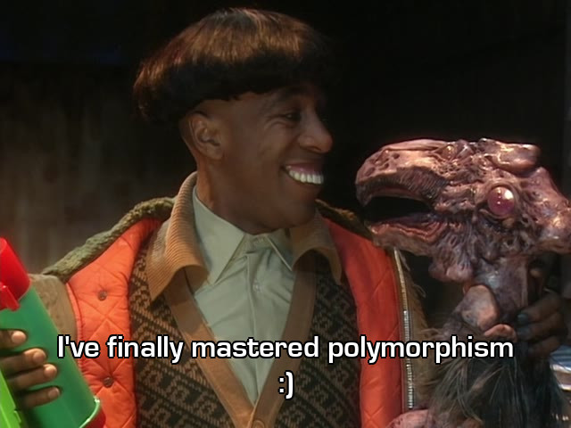

I have now added polymorphism capabilities into Malleable Models.




No, not that polymorph thankfully!

<!-- truncate -->

But sometimes your models will need lists of objects with a shared heritage 

```yaml
apiVersion: kadense.io/v1
kind: MalleableModule
metadata:
  name: test-polymorph
  namespace: default
spec:
  classes:
    PolymorphicBaseClass:
      discriminatorProperty: "type"
      properties:
        BaseStringProperty:
          type: string
    
    PolymorphicDerivedClass1:
      baseClass: PolymorphicBaseClass
      typeDiscriminator: DerivedString
      properties:
        DerivedStringProperty:
          type: string
    
    PolymorphicDerivedClass2:
      baseClass: PolymorphicBaseClass
      typeDiscriminator: DerivedInt
      properties:
        DerivedIntProperty:
          type: int    
```

The ***MalleableAssemblyBuilder*** will populate the ***MalleableAssembly*** that it generates with the configuration for the JsonSerializer. This can then be passed into the ***MalleablePolymorphicTypeResolver*** and in turn into the ***JsonSerializerOptions*** 

[Full information on polymorphism in Malleable Models can be found in the documentation.](https://headinthecloudsolutions.github.io/kadense/docs/The-Framework/Malleable-Modules/Polymorphism)