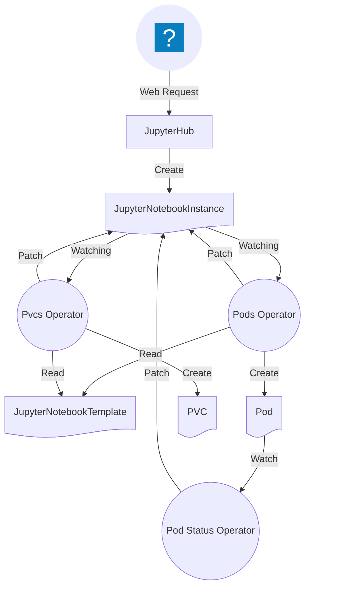

The Jupyternetes leverages custom resource definitions (CRDs) in Kubernetes to define templates:

```yaml
apiVersion: kadense.io/v1
kind: JupyterNotebookTemplate
metadata:
  annotations:
    meta.helm.sh/release-name: kadense
    meta.helm.sh/release-namespace: kadense
  creationTimestamp: "2025-04-18T21:57:33Z"
  generation: 4
  labels:
    app.kubernetes.io/managed-by: Helm
  name: default-template
  namespace: kadense
  resourceVersion: "340133"
  uid: 6ce0798d-ac32-4f8d-b40c-c47d4c43fd91
spec:
  pods:
  - labels:
      jupyternetes.kadense.io/userId: '{jupyterhub.user.id}'
    name: notebook
    spec:
      containers:
      - env:
        - name: JPY_API_TOKEN
          value: '{jupyterhub.api_token}'
        - name: JUPYTERHUB_ACTIVITY_URL
          value: http://hub.{jupyterhub.namespace}.svc.cluster.local:8081/hub/api/users/{jupyterhub.user.name}/activity
        - name: JUPYTERHUB_ADMIN_ACCESS
          value: "1"
        - name: JUPYTERHUB_API_TOKEN
          value: '{jupyterhub.api_token}'
        - name: JUPYTERHUB_API_URL
          value: http://hub.{jupyterhub.namespace}.svc.cluster.local:8081/hub/api
        - name: JUPYTERHUB_BASE_URL
          value: /
        - name: JUPYTERHUB_CLIENT_ID
          value: '{jupyterhub.oauth_client_id}'
        - name: JUPYTERHUB_COOKIE_HOST_PREFIX_ENABLED
          value: "0"
        - name: JUPYTERHUB_HOST
        - name: JUPYTERHUB_OAUTH_ACCESS_SCOPES
          value: '["access:servers!server={jupyterhub.user.name}/", "access:servers!user={jupyterhub.user.name}"]'
        - name: JUPYTERHUB_OAUTH_CALLBACK_URL
          value: /user/{jupyterhub.user.name}/oauth_callback
        - name: JUPYTERHUB_OAUTH_CLIENT_ALLOWED_SCOPES
          value: '[]'
        - name: JUPYTERHUB_OAUTH_SCOPES
          value: '["access:servers!server={jupyterhub.user.name}/", "access:servers!user={jupyterhub.user.name}"]'
        - name: JUPYTERHUB_PUBLIC_HUB_URL
        - name: JUPYTERHUB_PUBLIC_URL
        - name: JUPYTERHUB_SERVER_NAME
        - name: JUPYTERHUB_SERVICE_PREFIX
          value: /user/{jupyterhub.user.name}/
        - name: JUPYTERHUB_SERVICE_URL
          value: http://0.0.0.0:8888/user/{jupyterhub.user.name}/
        - name: JUPYTERHUB_USER
          value: '{jupyterhub.user.name}'
        - name: JUPYTER_IMAGE
          value: quay.io/jupyter/datascience-notebook:hub-5.2.1
        - name: JUPYTER_IMAGE_SPEC
          value: quay.io/jupyter/datascience-notebook:hub-5.2.1
        - name: MEM_GUARANTEE
          value: "1073741824"
        image: quay.io/jupyter/datascience-notebook:hub-5.2.1
        name: notebook
        ports:
        - containerPort: 8888
          name: http
          protocol: TCP
        volumeMounts:
        - mountPath: /home/{jupyterhub.user.name}/work
          name: workspace-pvc
      volumes:
      - name: workspace-pvc
        persistentVolumeClaim:
          claimName: '{jupyternetes.pvcs.workspace}'
  pvcs:
  - labels:
      jupyternetes.kadense.io/userId: '{jupyterhub.user.id}'
    name: workspace
    spec:
      accessModes:
      - ReadWriteOnce
      resources:
        requests:
          storage: 1Gi
``` 

You can do just about anything with this template that you can do in a standard pod spec in Kubernetes, making it incredibly flexible. You can use parameters which are passed into the solution from the hub in this template by wrapping them in curly brackets. 

Based on this, Jupyternetes creates a JupyterNotebookInstance resource in Kubernetes:

```yaml
apiVersion: kadense.io/v1
kind: JupyterNotebookInstance
metadata:
  generation: 1
  name: 8dc366d8a0f05869bfdb6e7eb3d83f65
  namespace: default
  resourceVersion: "344043"
  uid: 4dd3b943-af32-44f7-a405-8b81cb36ed6f
spec:
  template:
    name: default-template
    namespace: kadense
  variables:
    jupyterhub.api_token: 852dc4bd4e4e4360b7ae94cffa4f1c76
    jupyterhub.namespace: kadense
    jupyterhub.oauth_client_id: jupyterhub-user-jovyan
    jupyterhub.user.id: "1"
    jupyterhub.user.name: jovyan
    jupyternetes.instance.name: 8dc366d8a0f05869bfdb6e7eb3d83f65
    jupyternetes.instance.namespace: default
status:
  otherResources: {}
  otherResourcesProvisioned: {}
  pods: {}
  podsProvisioned: Pending
  pvcs: {}
  pvcsProvisioned: Pending
```
 
This will in turn trigger the various operators relating to the JupyterNotebookInstances.

### Operators


* [PVC Operator](./Operators/pvc-operator/intro.md) - Watches for JupyterNotebookInstances and creates Persistent Volume Claims based on the related template.
* [Pod Operator](./Operators/pod-operator/intro.md) - Watches for JupyterNotebookInstances and creates Pods based on the related template.
* [Pod Status Operator](./Operators/pod-status-operator/intro.md) - Watches Pods and updates related JupyterNotebookInstances with the pod status as it changes.
