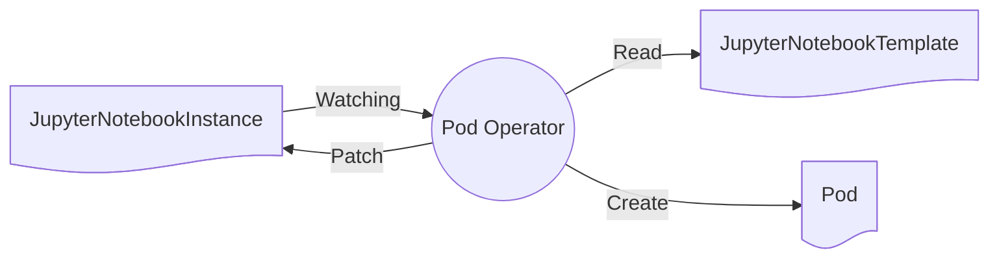

Once the PVC operator has finished working on the instance, the Pods operator will pickup the instance and will attempt to provision the pod as defined in the template. This will allow kubernetes to generate the unique name of the pod based upon the name supplied in the template.



```yaml
apiVersion: v1
kind: Pod
metadata:
  creationTimestamp: "2025-04-24T15:33:55Z"
  generateName: notebook-
  labels:
    jupyternetes.kadense.io/instance: 8dc366d8a0f05869bfdb6e7eb3d83f65
    jupyternetes.kadense.io/instanceNamespace: default
    jupyternetes.kadense.io/podName: notebook
    jupyternetes.kadense.io/template: default-template
    jupyternetes.kadense.io/templateNamespace: kadense
    jupyternetes.kadense.io/userId: "1"
  name: notebook-pvks5
  namespace: default
  resourceVersion: "344040"
  uid: 48093537-4cb3-4438-904a-ccad9715d703
spec:
  containers:
  - env:
    - name: JPY_API_TOKEN
      value: 852dc4bd4e4e4360b7ae94cffa4f1c76
    - name: JUPYTERHUB_ACTIVITY_URL
      value: http://hub.kadense.svc.cluster.local:8081/hub/api/users/jovyan/activity
    - name: JUPYTERHUB_ADMIN_ACCESS
      value: "1"
    - name: JUPYTERHUB_API_TOKEN
      value: 852dc4bd4e4e4360b7ae94cffa4f1c76
    - name: JUPYTERHUB_API_URL
      value: http://hub.kadense.svc.cluster.local:8081/hub/api
    - name: JUPYTERHUB_BASE_URL
      value: /
    - name: JUPYTERHUB_CLIENT_ID
      value: jupyterhub-user-jovyan
    - name: JUPYTERHUB_COOKIE_HOST_PREFIX_ENABLED
      value: "0"
    - name: JUPYTERHUB_HOST
    - name: JUPYTERHUB_OAUTH_ACCESS_SCOPES
      value: '["access:servers!server=jovyan/", "access:servers!user=jovyan"]'
    - name: JUPYTERHUB_OAUTH_CALLBACK_URL
      value: /user/jovyan/oauth_callback
    - name: JUPYTERHUB_OAUTH_CLIENT_ALLOWED_SCOPES
      value: '[]'
    - name: JUPYTERHUB_OAUTH_SCOPES
      value: '["access:servers!server=jovyan/", "access:servers!user=jovyan"]'
    - name: JUPYTERHUB_PUBLIC_HUB_URL
    - name: JUPYTERHUB_PUBLIC_URL
    - name: JUPYTERHUB_SERVER_NAME
    - name: JUPYTERHUB_SERVICE_PREFIX
      value: /user/jovyan/
    - name: JUPYTERHUB_SERVICE_URL
      value: http://0.0.0.0:8888/user/jovyan/
    - name: JUPYTERHUB_USER
      value: jovyan
    - name: JUPYTER_IMAGE
      value: quay.io/jupyter/datascience-notebook:hub-5.2.1
    - name: JUPYTER_IMAGE_SPEC
      value: quay.io/jupyter/datascience-notebook:hub-5.2.1
    - name: MEM_GUARANTEE
      value: "1073741824"
    image: quay.io/jupyter/datascience-notebook:hub-5.2.1
    imagePullPolicy: IfNotPresent
    name: notebook
    ports:
    - containerPort: 8888
      name: http
      protocol: TCP
    resources: {}
    terminationMessagePath: /dev/termination-log
    terminationMessagePolicy: File
    volumeMounts:
    - mountPath: /home/jovyan/work
      name: workspace-pvc
    - mountPath: /var/run/secrets/kubernetes.io/serviceaccount
      name: kube-api-access-dmdrf
      readOnly: true
  dnsPolicy: ClusterFirst
  enableServiceLinks: true
  nodeName: minikube
  preemptionPolicy: PreemptLowerPriority
  priority: 0
  restartPolicy: Always
  schedulerName: default-scheduler
  securityContext: {}
  serviceAccount: default
  serviceAccountName: default
  terminationGracePeriodSeconds: 30
  tolerations:
  - effect: NoExecute
    key: node.kubernetes.io/not-ready
    operator: Exists
    tolerationSeconds: 300
  - effect: NoExecute
    key: node.kubernetes.io/unreachable
    operator: Exists
    tolerationSeconds: 300
  volumes:
  - name: workspace-pvc
    persistentVolumeClaim:
      claimName: workspace-fphcr
  - name: kube-api-access-dmdrf
    projected:
      defaultMode: 420
      sources:
      - serviceAccountToken:
          expirationSeconds: 3607
          path: token
      - configMap:
          items:
          - key: ca.crt
            path: ca.crt
          name: kube-root-ca.crt
      - downwardAPI:
          items:
          - fieldRef:
              apiVersion: v1
              fieldPath: metadata.namespace
            path: namespace
```

Once this has been generated, the status for the JupyterNotebookInstance is patched with the name of the pod.

```yaml
status:
  otherResources: {}
  otherResourcesProvisioned: {}
  pods:
    notebook:
      errorMessage: ""
      parameters: {}
      resourceName: notebook-pvks5
      state: Processed
  podsProvisioned: Completed
  pvcs:
    workspace:
      parameters: {}
      resourceName: workspace-fphcr
      state: Processed
  pvcsProvisioned: Completed
```
