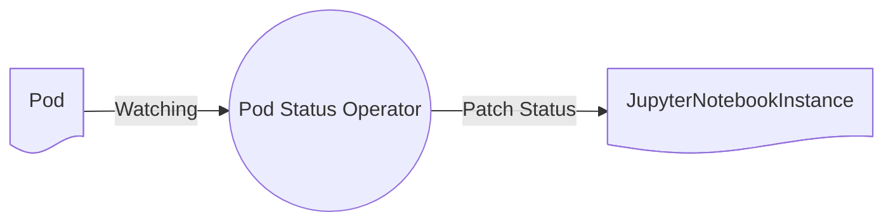

The jupyternetes pod status operator watches all of the pods on the cluster with labels relating to jupyternetes. It will patch the JupyterNotebookInstance resource which created the Pod with the status of that Pod as it updates, it will also pass along details about the pod such as the Ip Address of the pod. 



```yaml
status:
  otherResources: {}
  otherResourcesProvisioned: {}
  pods:
    notebook:
      errorMessage: ""
      parameters: {}
      podAddress: 10.244.1.129
      resourceName: notebook-pvks5
      state: Running
  podsProvisioned: Completed
  pvcs:
    workspace:
      parameters: {}
      resourceName: workspace-fphcr
      state: Processed
  pvcsProvisioned: Completed
```

This makes JupyterHub aware that the pod is ready to use, along with details on how to contact the pod.
