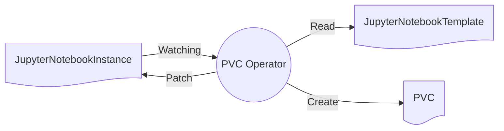

As Persistent Volume Claims (PVC's) are a prerequisite to pods, the system will try to provision any PVC's before Pods are processed by the pod operator.



The PVC operator will create the persistent volume claim as described in the template but will assign a name prefix and allow kubernetes itself to assign a unique name for the server.

```yaml
apiVersion: v1
kind: PersistentVolumeClaim
metadata:
  annotations:
    pv.kubernetes.io/bind-completed: "yes"
    pv.kubernetes.io/bound-by-controller: "yes"
    volume.beta.kubernetes.io/storage-provisioner: k8s.io/minikube-hostpath
    volume.kubernetes.io/storage-provisioner: k8s.io/minikube-hostpath
  creationTimestamp: "2025-04-18T22:21:43Z"
  finalizers:
  - kubernetes.io/pvc-protection
  generateName: workspace-
  labels:
    jupyternetes.kadense.io/instance: 8dc366d8a0f05869bfdb6e7eb3d83f65
    jupyternetes.kadense.io/instanceNamespace: default
    jupyternetes.kadense.io/pvcName: workspace
    jupyternetes.kadense.io/template: default-template
    jupyternetes.kadense.io/templateNamespace: kadense
    jupyternetes.kadense.io/userId: "1"
  name: workspace-fphcr
  namespace: default
  resourceVersion: "249445"
  uid: 81f19554-f828-44b9-b7de-c5deddee006a
spec:
  accessModes:
  - ReadWriteOnce
  resources:
    requests:
      storage: 1Gi
  storageClassName: standard
  volumeMode: Filesystem
  volumeName: pvc-81f19554-f828-44b9-b7de-c5deddee006a
status:
  accessModes:
  - ReadWriteOnce
  capacity:
    storage: 1Gi
  phase: Bound
```

The name of this PVC will then be patched into the status field of the JupyterNotebookInstance resource which triggered this PVC to be provisioned:

```yaml
status:
  otherResources: {}
  otherResourcesProvisioned: {}
  pods:
  podsProvisioned: Pending
  pvcsProvisioned: Completed
  pvcs:
    workspace:
      parameters: {}
      resourceName: workspace-fphcr
      state: Processed
```

This will in turn let the Pods operator know that it can now process the pods.

