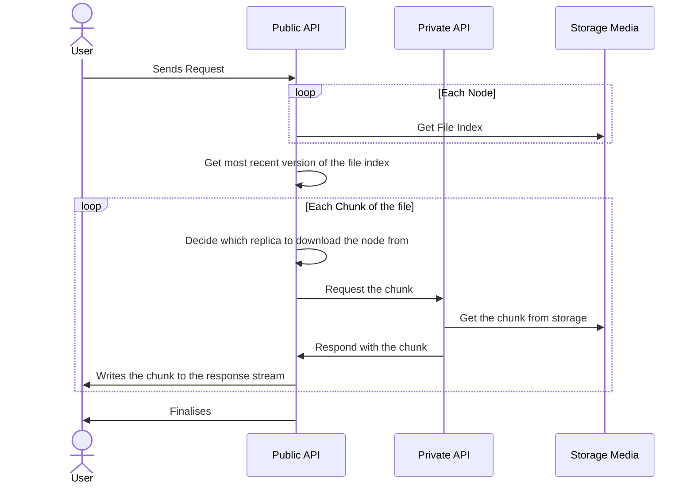

Storage of large files on distributed storage can be a challenge. Obviously there are many products out there to help with this, but sometimes you need control over the solution and need it to be customised to your particular use case. This can give a number of benefits, such as:

* Internal optimisation of the hardware/network/software
* A more generic solution with specific implementations can help you leverage
* Increased control over consistency, permissions, replication, caching strategies, etc
* No vendor lock-in allowing you to use any hardware, or provider
* Customised Scalability and Sharding Models
* Enhanced Capabilities - Preload scanning, signing, audit, custom event triggers, etc


```c-sharp
.UseEndpoints(cfg =>
{
    var storageApi = new StorageApiFactory()
        .WithLoggerProvider(loggingProvider) // logging
        .WithMedia(new FileSystemStorageApiMedia("/mnt/storage")) // Where to store the data on the backend
        .WithNodeDistributor(new StorageApiNodeDistributorRandom(nodeClients)) // How to choose which node to store on
        .WithBasePath($"/api/storage") // the base of the API to be exposed 
        .WithMaximumChunkSize(512) // how big each chunk can be when it is stored in a node
        .Build();
    
    storageApi.MapRoutes(cfg);
});
```

Each element of the storage system is highly extensible, allowing you to swap out for different methodologies. This is broken down into a number of areas:

| Area | Description |
| --- | --- |
| Media | Where to store the data on the backend, this is usually the file system, but doesn't have to be |
| NodeDistributor | How to decide where to allocate data |
| ChunkReplicaSelector | How to decide where to load data from |



