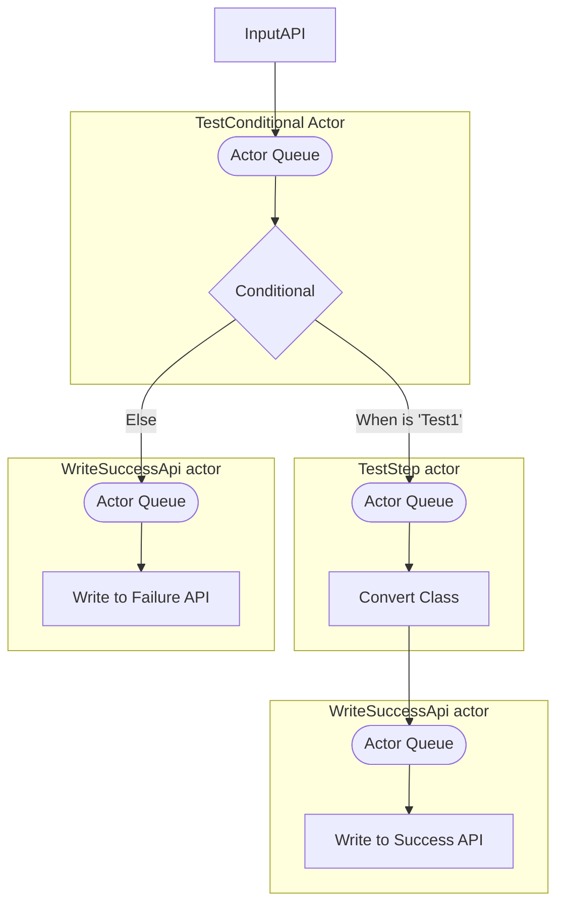
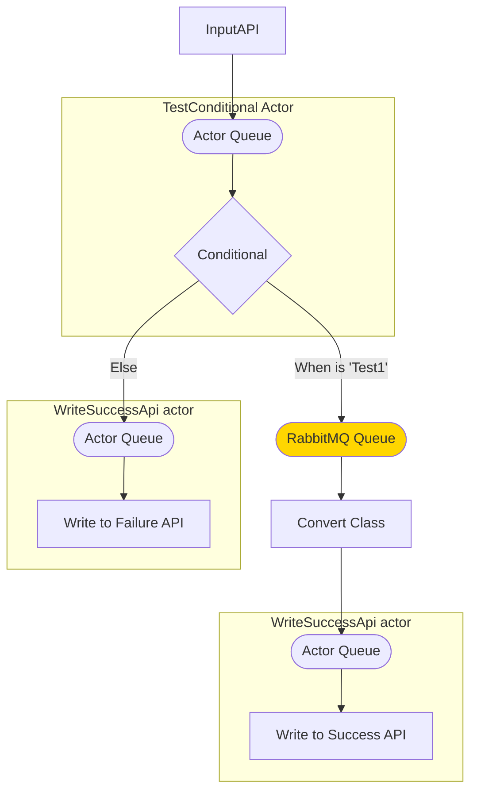
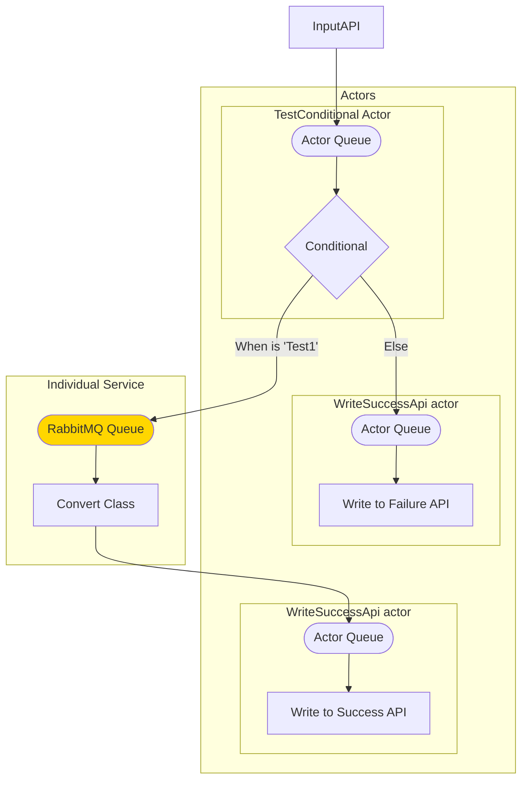
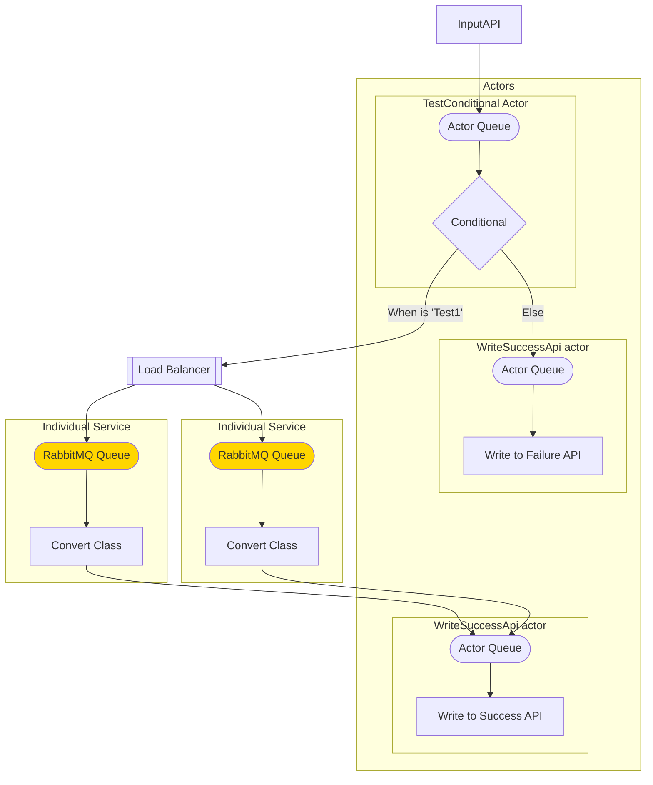

By default the workflow engine utilises Akka.Net actors, however you can use other executor types. Each executor type needs to implement a message queue for inbound messages.

```yaml
apiVersion: kadense.io/v1
kind: MalleableWorkflow
metadata:
    namespace: test-namespace
    name: test-workflow
spec:
    description: |
        Test workflow description
    apis:
      InputApi:
        apiType: Ingress
        ingressOptions:
            nextStep: TestConditional
        underlyingType:
            className: TestInheritedClass
            moduleName: test-module
            moduleNamespace: test-namespace
    steps:
      TestConditional:
        action: IfElse
        ifElseOptions:
            expressions:
            - expression: >
                Input.TestString == "test1"
              nextStep: TestStep
            elseStep: WriteFailureApi 
      TestStep:
        action: Convert
        converterOptions:
            converter:
                converterName: FromTestInheritedClassToTestClass
                moduleName: test-converter-module
                moduleNamespace: test-namespace
            nextStep: WriteSuccessApi
        executorType: RabbitMQ    
      WriteSuccessApi:
        action: WriteApi
        options:
            parameters:
                baseUrl: http://localhost:8080/
                path: >
                    "api/success"

      WriteFailureApi:
        action: WriteApi
        options:
            parameters:
                baseUrl: http://localhost:8080/
                path: api/failure


```

In the above definition, the job TestStep is a converter which utilises a RabbitMQ Queue instead of the Akka.Net actor model.

So under default circumstances, the solution will run as follows:



Now that we've updated the runner, we have the following instead:



If this step is a bottleneck for performance we could therefore potentially split it out into it's own individual service:



We could even load balance this service into multiple services fronted by a load balancer:

