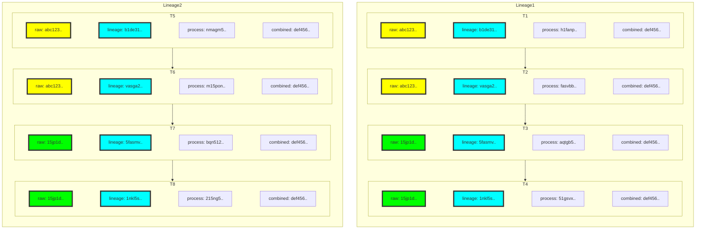

Kadense signs each message a number of times as it passes through each step of a workflow, each message is signed:

* Against the contents of the message, this is the raw signature.
* Against the raw signature, the step name, and the previous lineage signature for the message. This is the lineage signature.
* Against the raw signature, the step name, and the previous process signature for the processor. This is the process signature.
* Against the lineage signature, the process signature and the lineage ID. This is the combined signature.

In theory if you process a message through the system that are exactly the same and each step is configured the same then you should see exactly the same lineage signature each time it is processed by the time it reaches the end. 

This provides a useful debugging tool that helps you see where a workflow might be diverging if it is creating inconsistent results for whatever reason. It also provides a tamper evident audit that can be assessed if needed.




In the above diagram you've got two identical messages sent into the same basic workflow with an ingress and 3 steps. You can see from that the yellow blocks are are identical, this suggests that the contents of the messages haven't changed between the jobs. 

At some point between the yellow and green steps you can see that the contents have changed. This implies that there has been a conversion or enrichment task run against the data.

You can also see from the diagram that in both lineages, the messages followed exactly the same routes and returned the same data.

## Validating the audit
As we know the order in which each message has come in, and we know the then we should be able to verify the integrity of the audit by replaying all of the messages in the audit and generating the signatures. We don't need the underlying data, just the information in the audit itself.

If someone tampers with an audit message, the signature chains will be broken and this will become evident that someone has tampered with it. This is true whether or not they delete messages from the audit, or if they change the values in an individual audit record.

## Deactivating Message Signing

Obviously there is a cost to signing messages at each step so you can deactivate this functionality if you have no need of it.


```csharp
var builder = System
.AddWorkflow(workflow, malleableAssemblyList)
.WithMessageSigning(false); // Disabled message signing
```
