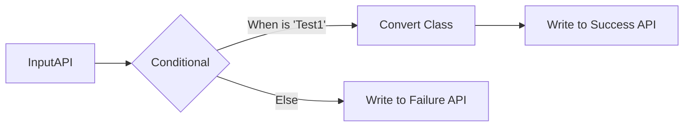

Another way to leverage your Malleable Models is to push those models through the Malleable Workflow Engine. You can define a workflow using the custom resources for it:

```yaml
apiVersion: kadense.io/v1
kind: MalleableWorkflow
metadata:
    namespace: test-namespace
    name: test-workflow
spec:
    description: |
        Test workflow description
    apis:
      InputApi:
        apiType: Ingress
        ingressOptions:
            nextStep: TestConditional
        underlyingType:
            className: TestInheritedClass
            moduleName: test-module
            moduleNamespace: test-namespace
    steps:
      TestConditional:
        action: IfElse
        ifElseOptions:
            expressions:
            - expression: >
                Input.TestString == "test1"
              nextStep: TestStep
            elseStep: WriteFailureApi 
      TestStep:
        action: Convert
        converterOptions:
            converter:
                converterName: FromTestInheritedClassToTestClass
                moduleName: test-converter-module
                moduleNamespace: test-namespace
            nextStep: WriteSuccessApi
    
      WriteSuccessApi:
        action: WriteApi
        options:
            parameters:
                baseUrl: http://localhost:8080/
                path: >
                    "api/success"

      WriteFailureApi:
        action: WriteApi
        options:
            parameters:
                baseUrl: http://localhost:8080/
                path: api/failure


```

This creates the following workflow:



This workflow by default leverages [Akka.Net](https://getakka.net/articles/intro/what-is-akka.html) actor models, however the design of the processors is generic enough that you could inject the processors into other models, for example you could integrate each component with kubernetes operators and a messaging platform which could run every step of the workflow as individual services, or you could create a hybrid of the two to create a balance between the two positions.